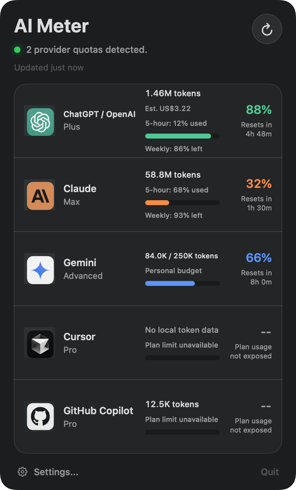

# AI Meter

AI Meter is a native macOS menu-bar app that puts your local AI usage in one
place. It can show live plan limits for Codex, measure tokens from local client
records, and track optional personal budgets for providers that do not expose
quota data.



## Highlights

- Live remaining-usage meters for Codex, and for Claude with an optional
  one-click status-line helper.
- Local token totals for OpenAI/Codex, Claude, Gemini, Cursor, and GitHub
  Copilot when compatible records are available.
- Automatic refresh every 1, 5, or 15 minutes, with battery-aware behavior.
- Optional token budgets and reset windows for providers without live limits.
- Optional local cost estimates from user-configured model pricing.
- Signed in-app updates via Sparkle, with optional automatic checking.
- No API keys, account credentials, or manual exports required.
- Local-first: AI Meter does not upload your usage records or include telemetry.

## Requirements

- macOS 14 Sonoma or later.
- Apple Silicon or Intel Mac.
- A supported AI client installed or previously used on this Mac.

AI Meter is a menu-bar-only app. It does not appear in the Dock after launch.

## Install

### Build and run from source

Building requires full Xcode with the Swift 6.2 toolchain. Command Line Tools
alone can build the app on some systems, but do not reliably include XCTest.

```sh
git clone https://github.com/anthonylimo90/ai-meter.git
cd ai-meter
./scripts/preflight.sh
./scripts/package_app.sh
open "dist/AI Meter.app"
```

The packaged app is written to `dist/AI Meter.app`. Move it to `/Applications`
if you want to keep it installed.

### Install a packaged release

When a `.pkg` build is available:

1. Download it from
   [GitHub Releases](https://github.com/anthonylimo90/ai-meter/releases).
2. Open the package and complete the installer.
3. Launch **AI Meter** from `/Applications`.
4. Look for AI Meter in the right side of the macOS menu bar.

## Getting Started

1. Launch AI Meter and select its menu-bar item.
2. Choose the refresh button to scan your local usage records.
3. Open **Settings > Providers** to disable clients you do not use.
4. Expand a provider to browse for an extra record file/folder or configure an
   optional fallback budget.
5. Open **Settings > General** to change the refresh interval or simplify the
   menu-bar display.

AI Meter discovers standard client folders automatically. A provider can still
show **Unavailable** when its folder is missing, its records do not contain
token metadata, or it does not publish a trustworthy plan limit.

## Provider Support

| Provider | Local source | What AI Meter can show |
| --- | --- | --- |
| OpenAI / Codex | `~/.codex/sessions` | Local tokens plus provider-reported 5-hour and weekly Codex plan windows when present |
| Claude | `~/.claude/projects` (+ optional status-line helper) | Local token totals, plus live 5-hour and weekly plan limits when **Show live Claude plan usage** is enabled |
| Gemini | `~/.gemini/tmp`, `~/.gemini/history` | Local tokens when compatible timestamped metadata is present |
| Cursor | `~/.cursor`, Cursor's `globalStorage` folder | Local tokens when compatible timestamped metadata is present |
| GitHub Copilot | Copilot CLI and VS Code `globalStorage` folders | Local tokens when compatible timestamped metadata is present |

For Gemini, Cursor, and Copilot, local client formats can change and may not
contain token counts. AI Meter reports unavailable data instead of estimating
usage. You can add a custom JSON, JSONL, or log folder in Provider settings.

## Plan Usage vs. Token Usage

AI Meter keeps two different measurements separate:

- **Plan usage** is a percentage and reset time reported by the provider's own
  client. AI Meter reads this for Codex from its local session records, and for
  Claude through the optional status-line helper (see **Claude live usage**).
- **Local token usage** is counted from compatible records stored on your Mac.
  It is useful for tracking activity, but it is not necessarily the same as a
  provider's billing or subscription quota.

When live plan usage is unavailable, you can configure a personal token budget,
window, and reset time. These are your own reference values, not provider data.
Leaving the fallback budget at `0` keeps the percentage unconfigured.

## Claude live usage

Claude Code does not record its plan limits in its session logs the way Codex
does, but it *does* pass them to a configured status line. AI Meter uses that
sanctioned, local channel.

Turn on **Settings > General > Show live Claude plan usage** and AI Meter:

1. Installs a small helper script and points Claude Code's `statusLine` at it
   (your existing status line, if any, is preserved and still runs).
2. The helper writes only Claude's `rate_limits` (5-hour and weekly
   `used_percentage` and reset times) to a file under
   `~/.config/ai-meter/`.
3. AI Meter reads that file and shows your live Claude plan usage.

This uses no account credentials and makes no network requests — Claude Code
itself hands AI Meter the data through its
[documented status line](https://code.claude.com/docs/en/statusline). The values
update while Claude Code is running; when it is idle, AI Meter shows the last
known reading until its window resets. Turning the setting off removes the helper
and restores your previous status line.

## Cost Estimates

AI Meter can estimate local token cost when you enable **Estimate token cost** in
provider settings and enter USD-per-million-token rates for a model. These
estimates are calculated locally from compatible usage records. They are not
provider billing statements.

Actual bills can differ because local records may omit model names or token
splits, providers may apply subscription terms, caching discounts, credits,
taxes, usage buckets, or other account-level adjustments, and official pricing
can change. Keep the configured rates aligned with the provider's current
pricing page if you use cost estimates for planning.

## Privacy

AI Meter reads only the local folders listed in **Settings > Providers** and any
extra folder you add. It does not ask for or read provider account credentials,
launch other applications, or make network requests to read usage — every
reading comes from records already on your Mac.

For updates, AI Meter uses [Sparkle](https://sparkle-project.org). When you
check for updates — or, if you opt in, on Sparkle's periodic schedule — it
fetches a small update feed (an "appcast") served from this project's GitHub
Pages site. The request sends no usage data, account data, or identifiers, only
the standard IP address and user agent. Automatic checking is **off by default**.

## Updating

AI Meter updates itself in place:

1. Open **Settings > About** and select **Check for Updates** (or enable
   **Check for updates automatically**).
2. If a newer version exists, Sparkle shows the release and an **Install**
   button.
3. AI Meter verifies the update's cryptographic (EdDSA) signature, replaces
   itself, and relaunches.

Every update is signed with a private key held only in CI; the app embeds the
matching public key and refuses any update that fails verification. See
`docs/auto-update-plan.md` for the design.

## Troubleshooting

**macOS says the installer "could not verify… is free of malware"**

AI Meter releases are not yet notarized by Apple, so macOS quarantines the
downloaded package and Gatekeeper blocks it. The package is unaffected; this is
the standard prompt for software distributed outside the App Store. Install it
either way:

- Remove the quarantine flag, then open it (replace `<version>` and the path if
  you saved it elsewhere):

  ```sh
  xattr -d com.apple.quarantine ~/Downloads/AI.Meter-<version>.pkg
  open ~/Downloads/AI.Meter-<version>.pkg
  ```

- Or double-click the package, then open **System Settings > Privacy &
  Security**, find the blocked-item message under **Security**, and choose
  **Open Anyway**.

This affects only the first install from a download. In-app updates are
cryptographically verified (see [Updating](#updating)) and are not subject to
this prompt.

**AI Meter launched but no window appeared**

This is expected. Select AI Meter on the right side of the menu bar.

**A provider says "No local data folder is available"**

Run that provider's local client at least once, then refresh AI Meter. You can
also add the correct folder under **Settings > Providers > Extra folder**.

**Records were found, but usage is unavailable**

The files may not contain timestamped token metadata that AI Meter recognizes.
This is common for clients that do not expose token-level usage locally.

**Claude shows tokens but no plan percentage**

By default Claude shows local token totals only. To see live 5-hour and weekly
limits, enable **Settings > General > Show live Claude plan usage** (see
[Claude live usage](#claude-live-usage)). The percentage appears after Claude
Code runs and refreshes its status line at least once.

**Refreshes are less frequent than configured**

macOS Low Power Mode limits background refreshes to every 15 minutes. Opening
the menu or choosing **Refresh Now** can update sooner.

## Development

Verify the selected Xcode toolchain, then run the test suite and build:

```sh
./scripts/preflight.sh
swift test
./scripts/package_app.sh
```

Build an installer package:

```sh
./scripts/package_installer.sh
```

Outputs:

- `dist/AI Meter.app`
- `dist/AI Meter-<version>.pkg`

Generate deterministic screenshots without reading local provider data:

```sh
swift run AIMeterSnapshot implementation.png
swift run AIMeterSnapshot settings.png --settings
swift run AIMeterSnapshot menubar.png --menubar
```

Public releases are universal (`arm64` and `x86_64`), Developer ID signed,
hardened, notarized, and stapled. Configure the signing identities and a
`notarytool` keychain profile, then run:

```sh
APP_SIGN_IDENTITY="Developer ID Application: Example (TEAMID)" \
INSTALLER_SIGN_IDENTITY="Developer ID Installer: Example (TEAMID)" \
NOTARY_PROFILE="ai-meter-release" \
./scripts/package_release.sh
```

Version and build metadata live in `Config/version.env`. Release automation is
defined in `.github/workflows/release.yml`.

## Uninstall

Quit AI Meter, then remove `/Applications/AI Meter.app`, or run:

```sh
./scripts/uninstall_app.sh
```
